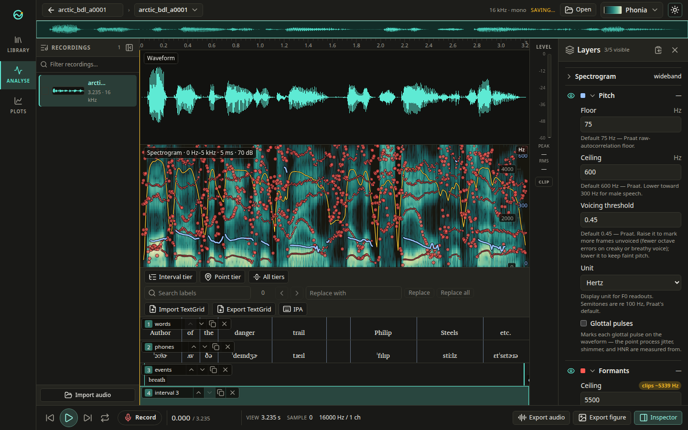
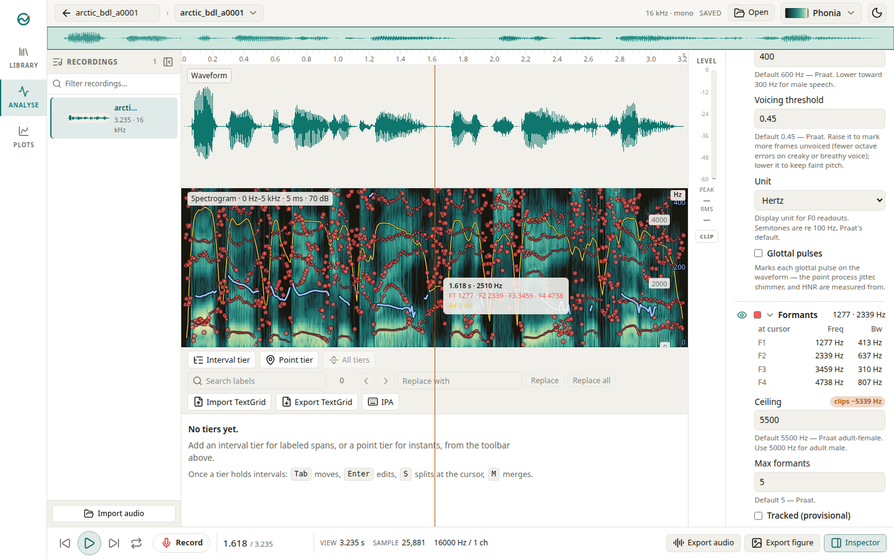

<p align="center">
  <picture>
    <source media="(prefers-color-scheme: dark)" srcset="docs/brand/logo-dark.svg">
    
  </picture>
</p>

<p align="center">
  <a href="https://github.com/mkpoli/phonia/actions/workflows/ci.yml"></a>
  <a href="https://github.com/mkpoli/phonia/releases"></a>
  <a href="LICENSE-MIT"></a>
  <a href="rust-toolchain.toml"></a>
</p>

Phonia is an open-source toolkit for phonetic research, built for the work
phonetics labs do in [Praat](https://www.fon.hum.uva.nl/praat/) every day:
viewing spectrograms, measuring pitch, formants, and voice quality, annotating
recordings, and drawing figures for publication. It runs in the browser with
nothing to install, and as a desktop app for native playback and PDF export.

- Try it: <https://phonia.app>
- About: <https://about.phonia.app>
- Desktop downloads: <https://github.com/mkpoli/phonia/releases>





## Analysis

- **Spectrogram** — Gaussian-window STFT power spectral density in dB, wideband
  through narrowband, computed in viewport-independent tiles; perceptual
  colormaps with a grayscale ramp for print.
- **Pitch** — window-corrected autocorrelation candidates with a Viterbi path
  finder (Boersma 1993), with the full parameter surface and
  Praat-documented defaults.
- **Formants** — pre-emphasis, Burg recursion, and polynomial roots resolved to
  frequency and bandwidth, tracked with Xia–Espy–Wilson dynamic programming.
- **Intensity** — squared signal convolved with a Gaussian window, read in dB
  SPL.
- **Voice report** — glottal pulse extraction, jitter and shimmer families,
  HNR, CPP/CPPS, and spectral moments over a selection.

## Editing and export

- Interval and point tiers with typed parent/child relations, an IPA input
  pad, and label search across the corpus.
- Praat TextGrid import and export: the reader takes the long and short text
  formats (UTF-8, UTF-16, or Latin-1) and the binary format.
- A recordings table with waveform thumbnails, duration and sample-rate
  readouts, and tagging; project files autosave and recover after a crash.
- Figures export through an SVG scene graph — the on-screen preview and the
  saved SVG are byte-identical. PNG export runs in the browser, PDF in the
  desktop app.
- Every action sits in the command palette (`Ctrl-K`, `⌘K` on macOS), and one
  undo stack covers tier edits, imports, and boundary moves.

## Architecture

A Rust analysis core drives two interfaces, a browser app and a Tauri desktop
app. The core is a Cargo workspace of small library crates with no UI
dependencies, compiled natively for the desktop and to WebAssembly for the
browser. Library crates carry the `phonia-` prefix. Each crate owns one concern:

| Crate | Responsibility |
| --- | --- |
| [`phonia-audio`](crates/phonia-audio) | Planar f32 audio with sample rate; WAV, AIFF, FLAC, MP3; resampling |
| [`phonia-dsp`](crates/phonia-dsp) | Windows, real FFT wrappers, absolute-time frame grids, interpolation, pre-emphasis |
| [`phonia-spectrogram`](crates/phonia-spectrogram) | Gaussian-window STFT spectral density in dB, viewport-independent tiles |
| [`phonia-pitch`](crates/phonia-pitch) | Autocorrelation candidates and Viterbi tracking |
| [`phonia-formant`](crates/phonia-formant) | Burg analysis and formant tracking |
| [`phonia-intensity`](crates/phonia-intensity) | Gaussian-smoothed intensity in dB SPL |
| [`phonia-voice`](crates/phonia-voice) | Pulses, jitter, shimmer, HNR, CPP, spectral moments |
| [`phonia-annot`](crates/phonia-annot) | Interval and point tiers, tier relations, invertible edits |
| [`phonia-textgrid`](crates/phonia-textgrid) | Praat TextGrid reader and writer |
| [`phonia-project`](crates/phonia-project) | Versioned project files, media references, parameter profiles, autosave |
| [`phonia-render`](crates/phonia-render) | Perceptual colormaps, theme-aware tile rendering |
| [`phonia-figure`](crates/phonia-figure) | Figure model and exporters over an SVG scene graph |
| [`phonia-playback`](crates/phonia-playback) | Native audio output behind a playback trait |
| [`phonia-engine`](crates/phonia-engine) | The API both frontends consume: commands, journaled undo, analysis cache |
| [`phonia-wasm`](crates/phonia-wasm) | WebAssembly bindings over the engine |

Three app packages sit on the core: `apps/web` (SvelteKit frontend compiled to
WebAssembly), `apps/desktop` (Tauri shell with native playback), and `apps/ui`
(the Svelte component library shared by both).

## Building from source

Requires Rust 1.88 or newer, `wasm-pack`, and Bun.

```sh
bun install
bun run --cwd apps/web dev
```

The dev task compiles the core to WebAssembly first, then serves the web app.
A production build of the web app is `bun run build` from the repository root;
the desktop app runs with `bun run --cwd apps/desktop tauri dev`.

Tests: `cargo test` for the core, `bun run test:e2e` for the end-to-end suite.

## License

Dual-licensed under [MIT](LICENSE-MIT) or
[Apache-2.0](LICENSE-APACHE), at your option.
